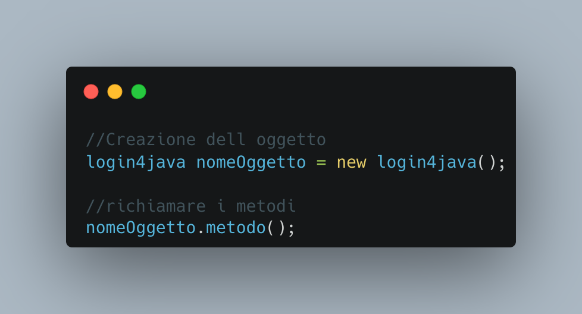

# General

*This program has the objective of developing an algorithm   to handle logins to your software by using a few   lines of code to implement an authenticator manager* 

# Functions

- *`setup()`: Executes the setup of the application creating all the settings (if the program is executed and a configuration file already exists the original config file gets loaded with its own settings*
- *`singup()`: Executes the registration of the user based on the config*
- *`loadConfig()`: Loads the config from the file (this operation is executed from the setup) if not it can be manually executed by calling its method *
- *`sigin(email, password)`: Executes the login passing email and password as its parameters. Returns "notaccess" in case of wring login info or not-existing user or "ok" if the login happens with success*

# Installation and Configuration

- *In the first step all files must be downloaded and pt in a known folder: you can move your own program files in the root of the folder containing files*

- *Create the object in your own file with empty parameters*
- *Recall with the methods cited above*

# Incoming features
- *Password Reset*
- *Handling of permissions*
- *Admin control panel*

[Visualizza la spiegazione del progetto](./user-man.md)
